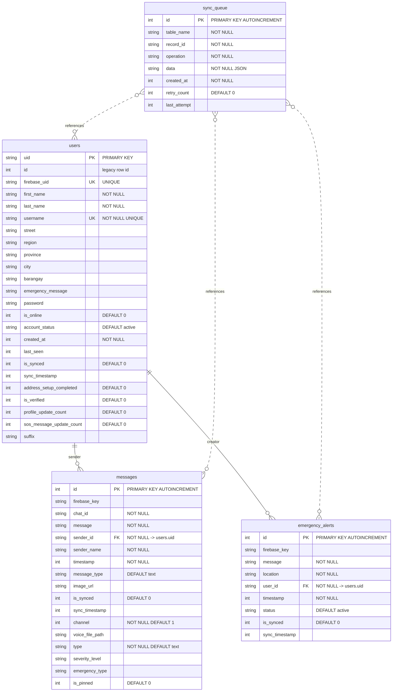
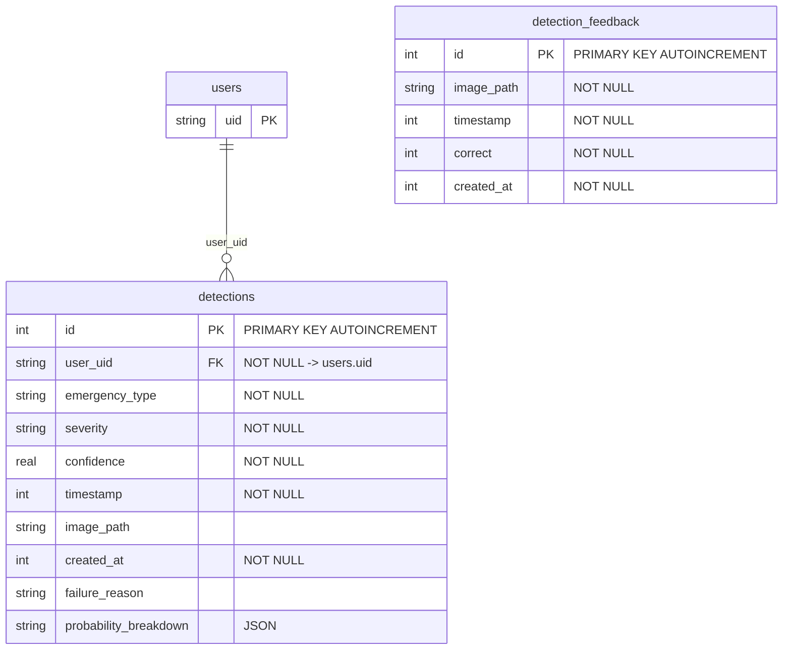
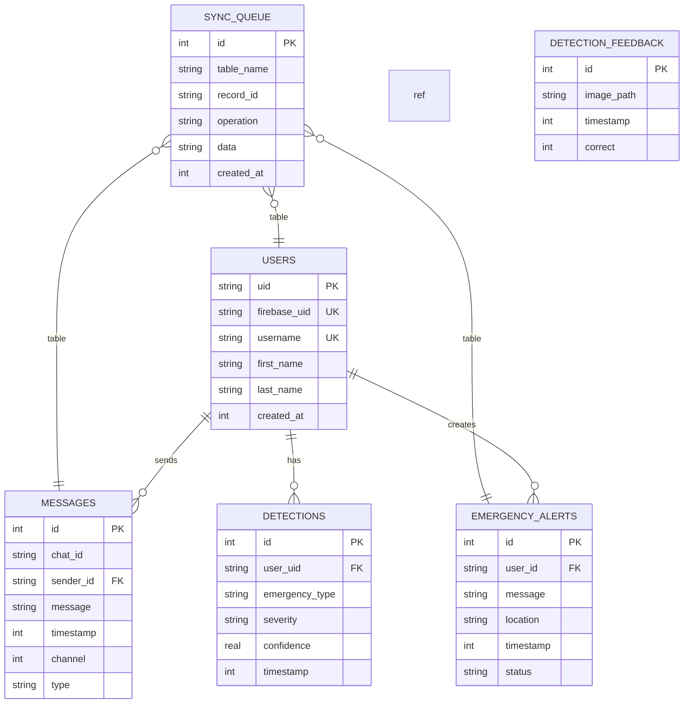

# Tulong Database – ERD (Entity Relationship Diagram)

## Database: tulong_offline.db

---

## Database: detection_history.db (separate DB)

---

## Combined overview (all entities)

---

## Legend

| Symbol | Meaning |
|--------|--------|
| **PK** | Primary Key |
| **FK** | Foreign Key (logical; not enforced in SQLite DDL) |
| **UK** | Unique |
| `\|\|--o{` | One-to-many (one user, many messages) |
| `}o--\|\|` | Reference (sync_queue references table_name + record_id) |

*Note: `users` in detection_history.db is the same entity (users.uid) but in a different database file.*
